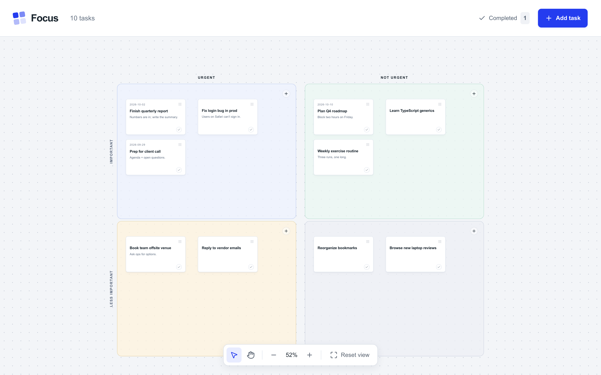

# Focus — Eisenhower Matrix

A private, drag-and-drop Eisenhower board that runs on your own machine and keeps every task in a single CSV file.



| | Urgent | Not urgent |
|---|---|---|
| **Important** | **Do first**: important and time-sensitive | **Schedule**: protect time for meaningful work |
| **Not important** | **Delegate**: keep it moving without doing it all | **Let go**: not everything needs your attention |

## Features

- Drag cards between quadrants; pan, zoom and reset the canvas
- Per-task notes, due date, completion toggle, and lists of sources and links
- Keyboard support for moving and opening cards
- Everything saved to `data/tasks.csv`, one row per task, which you can open in Numbers, Excel or a text editor

The board starts empty. No task data ships with this repo, and `data/` is git-ignored.

## Quick start

Requires Node.js `>=22.12` (for the build; the server itself has no dependencies).

```sh
npm install
npm run build
npm start              # http://127.0.0.1:5180
```

For development with hot reload, use `npm run dev` (same port, same data file).

## Your data

All tasks live in `data/tasks.csv`:

| column | meaning |
|---|---|
| `id` | unique id (any string; leave blank on a hand-added row and one is generated) |
| `title` | task title |
| `quadrant` | `Do first`, `Schedule`, `Delegate` or `Let go` |
| `done` | `true` / `false` (`yes`, `1` and `x` also count as done) |
| `due` | `YYYY-MM-DD` or blank |
| `notes` | free text, may span lines |
| `sources`, `links` | JSON list of `{"label","url"}` |
| `x`, `y` | card position on the canvas |
| `created_at`, `updated_at` | ISO timestamps, set by the server |

- The file is re-read on every page load, so hand edits show up after a refresh. Avoid editing while the board is open in a browser, or the next save from the page may overwrite your edit.
- Every save writes atomically and first copies the previous version to `data/tasks.csv.bak`.
- **Backups:** copy the file anywhere, or point the board at a synced folder:
  `DATA_FILE=~/Library/Mobile\ Documents/com~apple~CloudDocs/focus/tasks.csv npm start`

## Run it all the time (macOS)

A per-user LaunchAgent starts the board at login and restarts it if it crashes.

```sh
npm install && npm run build
npm run service:install        # installs ~/Library/LaunchAgents/local.eisenhower-matrix.plist and starts it
```

Then bookmark http://127.0.0.1:5180.

| command | what it does |
|---|---|
| `npm run service:status` | show state and PID |
| `npm run service:logs` | tail `logs/server.log` |
| `npm run service:restart` | restart (do this after `git pull && npm run build`) |
| `npm run service:uninstall` | stop and remove the LaunchAgent (data is untouched) |

Options are read at install time; re-run `service:install` to change them:

```sh
PORT=5180 DATA_FILE=/path/to/tasks.csv NODE=/path/to/node npm run service:install
```

`NODE` defaults to whatever `node` is on your `PATH` when you install. If you use nvm and later remove that Node version, reinstall the service.

### Linux (systemd)

```ini
# ~/.config/systemd/user/eisenhower-matrix.service
[Unit]
Description=Eisenhower matrix board

[Service]
WorkingDirectory=/path/to/eisenhower-matrix
ExecStart=/usr/bin/node server.mjs
Environment=PORT=5180
Restart=always

[Install]
WantedBy=default.target
```

```sh
systemctl --user enable --now eisenhower-matrix
```

## Configuration

| env var | default | |
|---|---|---|
| `PORT` | `5180` | |
| `HOST` | `127.0.0.1` | loopback only; set `0.0.0.0` to expose on your network (there is no auth) |
| `DATA_FILE` | `data/tasks.csv` | relative paths resolve from the repo root |

## Layout

- `server.mjs`: zero-dependency Node server that serves the built app and `GET / PUT / DELETE /api/tasks`
- `lib/store.mjs`: CSV read/write, serialized so concurrent saves never clobber each other
- `lib/tasks.ts`: task types, quadrant definitions, card placement
- `src/App.tsx`: the board UI (React 19, Tailwind 4, shadcn/ui dialog)
- `scripts/service.sh`: macOS LaunchAgent install/uninstall
