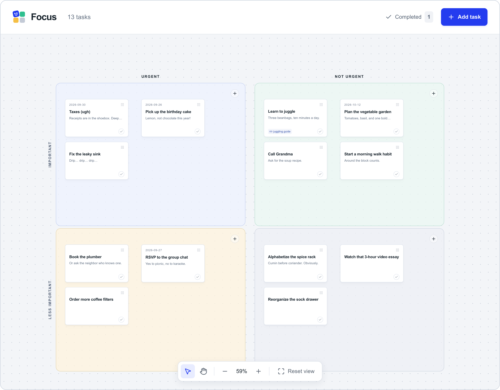
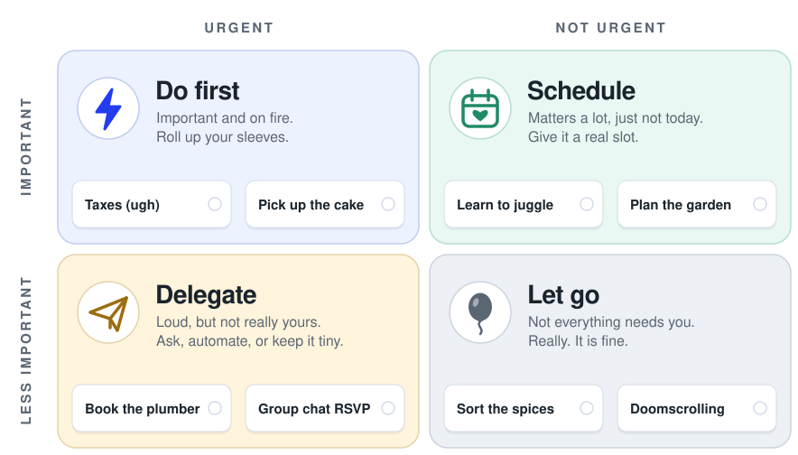
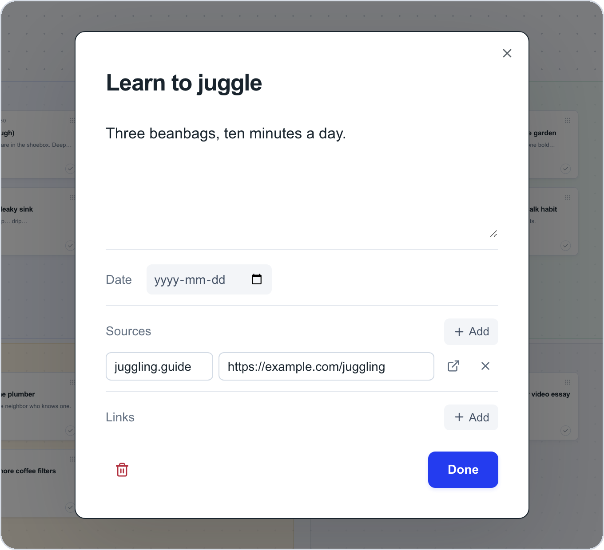

<div align="center">

<picture>
  <source media="(prefers-color-scheme: dark)" srcset="docs/assets/logo-dark.svg">
  
</picture>

**A cozy drag-and-drop board for sorting your to-dos into what matters now, what matters later, and what can quietly float away.**

   

</div>

<br>



## What is this?

You know that feeling when everything on your list is shouting at once? Focus is a big, calm canvas with four boxes on it. You drop each task into the box where it belongs, and suddenly the shouting turns into a plan.

It's based on the **Eisenhower matrix**, a very old and very good trick: ask two questions about every task (*is it urgent?* and *is it important?*) and the answer tells you what to do with it.

- **Drag cards around** like sticky notes. Pan and zoom the canvas as much as you like.
- **Jot things down**: every card has room for notes, a due date, and links to whatever you need.
- **Tick things off** and watch them move to your "Completed" pile.
- **Keyboard friendly**: <kbd>Enter</kbd> opens a card, <kbd>Alt</kbd> + arrow keys hop it to another box.
- **Your tasks are just a spreadsheet.** Everything lives in one plain `tasks.csv` file on your computer.

## The four boxes

<p align="center">
<picture>
  <source media="(prefers-color-scheme: dark)" srcset="docs/assets/quadrants-dark.svg">
  
</picture>
</p>

- **Do first**: urgent *and* important. The fire is real; grab the extinguisher.
- **Schedule**: important, not urgent. This is where the good stuff lives, so give it a real slot on the calendar before it turns into a fire.
- **Delegate**: urgent, but not really yours. Hand it off, automate it, or do the tiniest version.
- **Let go**: neither. Permission granted to not do it. It's fine. Really.

A small secret: the more you look after **Schedule**, the quieter **Do first** gets.

## Up close

<p align="center">
  
</p>

Click any card to open it. Write as much or as little as you like, add a date, and keep the links you need right next to the task.

## Where do my tasks go?

<p align="center">
<picture>
  <source media="(prefers-color-scheme: dark)" srcset="docs/assets/how-it-works-dark.svg">
  
</picture>
</p>

Nowhere far. Focus runs on your own computer and saves every change to a single file, `data/tasks.csv`. No sign-up, no sync server, nobody peeking. Want to see your tasks as a spreadsheet? Open the file in Numbers or Excel. Want a backup? Copy the file. That's the whole story.

## Get it running

You'll need [Node.js](https://nodejs.org) 22.12 or newer. Then, from this folder:

```sh
npm install
npm run build
npm run service:install
```

Now open **http://127.0.0.1:5180** and bookmark it. On a Mac, that last command keeps Focus running quietly in the background: it starts when you log in and picks itself back up if it ever trips. Your board is always one bookmark away.

Just want to try it once? Use `npm start` instead of `service:install`.

## The nerdy bits

Other ports, a different data file, Linux, hot-reload development, the CSV column reference and backups: it's all in **[docs/SETUP.md](docs/SETUP.md)**.

<br>

<p align="center"><sub>Made with care for people with too many tabs open.</sub></p>
